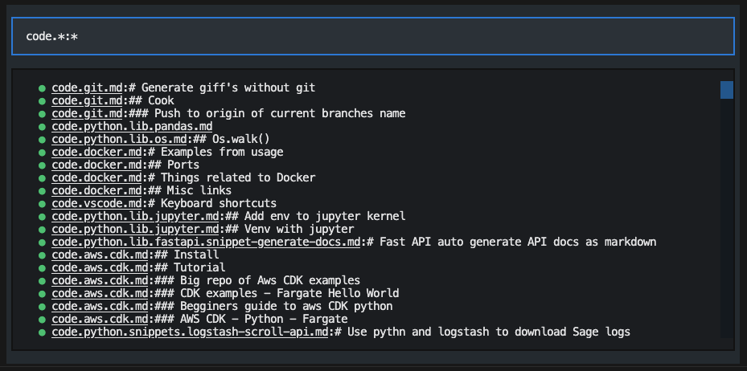

# TreeNotes

A tool to interact with your markdown notes like one large tree. 

Very early on / WIP. Project started in [bs7280/Alfred-Note-Capture](https://github.com/bs7280/Alfred-Note-Capture) as a macos workflow tool, but moving core code to this repo.

Heavily inspired by dendron and applied towards my obsidian notes.

Features (planned or implemented):
- Search for notes by filename and header with a glob pattern
- Insert notes into a 'node' 
- Refactor a large note into sub notes

## CLI
`python src/cli.py search '*python*'`

```
Search pattern: *python*
--------------------------------------------------------------------------------
code.python.lib.pandas.md
code.python.lib.os.md
code.python.lib.jupyter.md
code.python.lib.fastapi.snippet-generate-docs.md
prj.python-map-plotting.marketing.md
code.python.snippets.logstash-scroll-api.md
code.python.lib.dask.md
prj.python-map-plotting.streamlit.md
```

## TUI

